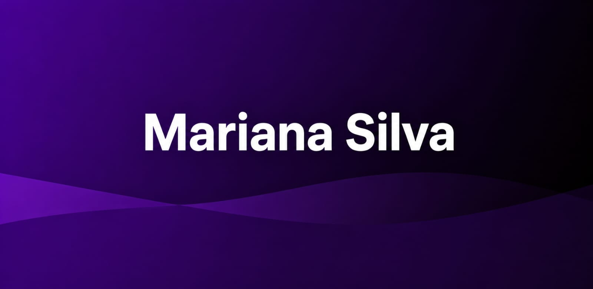

<div align="center">

# 🤖 S Y S T E M ・ O N L I N E




</div>

---

# 💻 AI TERMINAL

```bash
╔════════════════════════════════════════════════════╗
║             DEVELOPER CORE v3.0                   ║
╚════════════════════════════════════════════════════╝

Loading modules...

██████████████████████████████ 100%

✔ Developer Loaded
✔ Creativity Engine Online
✔ AI Module Enabled
✔ Projects Loaded
✔ GitHub Connected
✔ Deploy Service Running

STATUS: ONLINE 🚀
```

---

# 👨‍💻 About Me

```javascript
const Developer = {

    name: "Alex Carter",

    role: "Full Stack Developer",

    country: "Earth 🌎",

    focus: [
        "Frontend",
        "Backend",
        "Cloud",
        "Artificial Intelligence"
    ],

    currentlyLearning: [
        "Machine Learning",
        "Microservices",
        "System Design",
        "Cloud Computing"
    ],

    hobbies: [
        "Coding",
        "Music",
        "Coffee",
        "Technology"
    ],

    lifeGoal:
        "Transform ideas into incredible digital experiences."
}
```

---

# ⚡ Tech Stack

<div align="center">

### Front-End


### Back-End


### Database


### Tools


</div>

---

# 🚀 Current Mission

```bash
> Initializing objectives...

Frontend Development
██████████████████████ 100%

Backend Development
█████████████████░░░░ 82%

Artificial Intelligence
██████████████░░░░░░ 68%

Cloud Computing
███████████░░░░░░░░░ 56%

Open Source
███████████████████░ 95%

Status:
Never Stop Learning 🚀
```

---

# 🛰 Developer Console

```console
$ whoami

Alex Carter

$ profession

Full Stack Developer

$ editor

Visual Studio Code

$ favorite_language

TypeScript

$ current_project

Building Modern Web Applications

$ coffee

∞ Cups

$ motivation

while(alive){
    learn();
    build();
    improve();
}
```

---

# 🛠 Skills

| Category | Technologies |
|----------|--------------|
| Frontend | React • Next.js • Vue • HTML • CSS • JavaScript • TypeScript |
| Backend | Node.js • Express • Java • Spring Boot • Python |
| Database | PostgreSQL • MySQL • MongoDB • Supabase |
| DevOps | Docker • Linux • GitHub Actions |
| Design | Figma • UI/UX |

---

# 📊 GitHub Analytics

<div align="center">


</div>

<div align="center">


</div>

---

# 📈 Contribution Graph

<div align="center">


</div>

---

# 🏆 GitHub Trophies

<div align="center">


</div>

---

# 🐍 Contribution Snake

<div align="center">


</div>

---

# 🌟 Featured Projects

| 🚀 Project | 💡 Description | ⚙️ Stack |
|------------|---------------|----------|
| Nova UI | Modern dashboard | React + TypeScript |
| AI Studio | Artificial Intelligence Platform | Python |
| CloudFlow | Cloud Management | Node.js |
| Task Manager | Productivity App | React |
| Portfolio | Personal Website | Next.js |
| CommerceX | Ecommerce | Spring Boot |
| DevHub | Social Platform | Full Stack |

---
